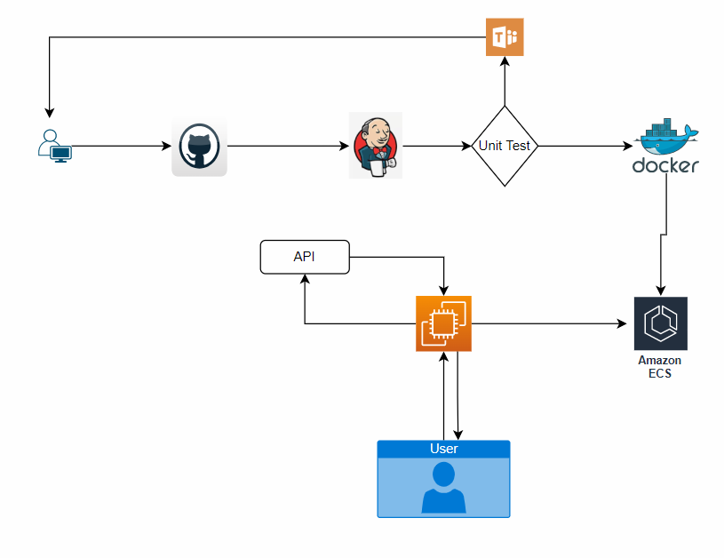
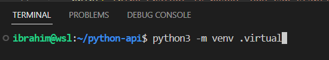
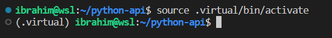
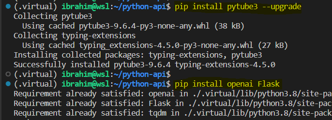
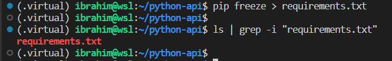
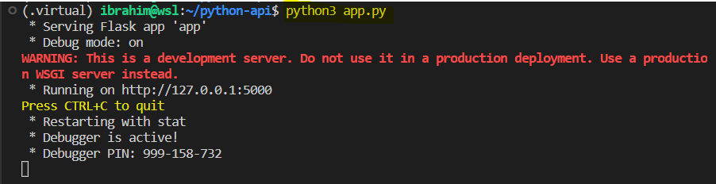
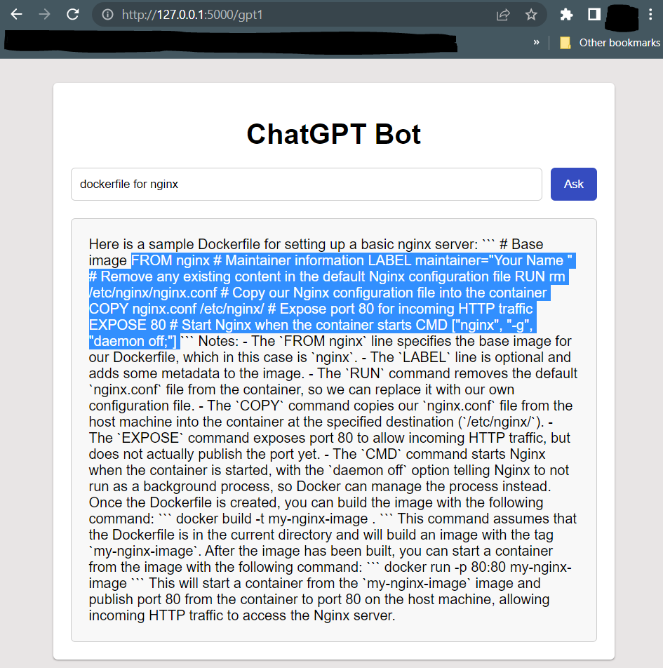
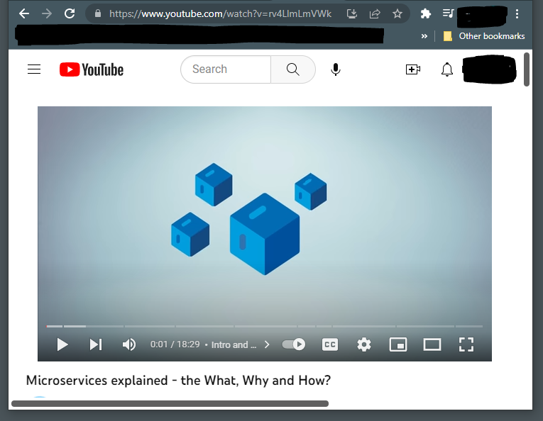
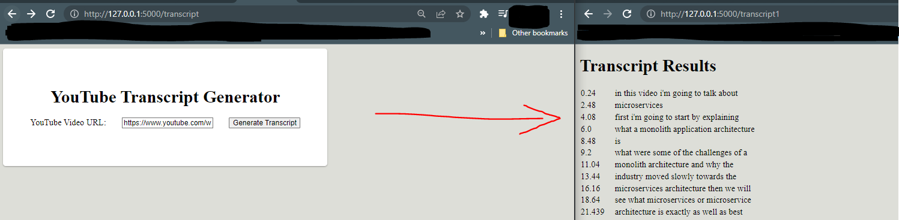
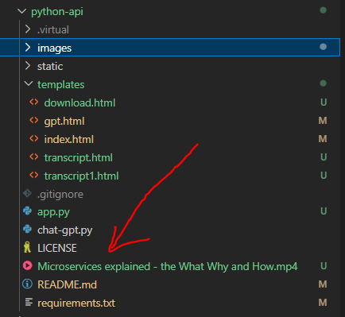

## API-Powered Applications
This project is for learning and practicing APIs integration and Flask. See sources linked below.<br>
We are building Flask web applications with a user interfaces:
* An AI-powered chatbot with ChatGPT `gpt-3.5-turbo` model
* A Python YouTube video Downloader
* And more to come ...

### 0. Good to know
* Basic cloud computing knowledge
* SSH into a server
* Basic scripting

### 1. Software Tools
* **Languages**: Python, HTML, CSS, Flask
* **CI/CD**: Jenkins
* **Source Control**: Git, GitHub
* **CSP**: AWS

### 2. Architechtures
* Apllications Architechtures
* CI/CD Pipeline

This is the workflow of the pipeline.



### 3. Set Up Virtual Environment for local testing
1. Create a folder and `cd` into it and set up the file architecture.

2. Create the virtual environment:
```
python3 -m venv virtual_environment_name
```



3. Activate the virtial environment
```
source virtual_environment_name/bin/activate
```



**Note**: Use a `.gitignore` file to avoid inporting the virtual environment folder (and/or other unwanted files) to GitHub. <br> Use `deactivate` to deactivate the virtual environment.

4. Install Requirements:
* Set up [virtual](https://packaging.python.org/en/latest/guides/installing-using-pip-and-virtual-environments/) environment.
* Install the requirements using `pip`.
```
pip install --upgrade
pip install flask
pip install pytest
pip install openai
pip install pytube3
pip install youtube_transcript_api
```



* You can also add the `requirements.txt` file in your project folder and install from it by using the command below.
```
pip install -r requirements.txt
```
Here is how to get the `requirements.txt` file.



#### Set up local Environment Variables for API Keys
* Local Environment Variables (in Linux Ubuntu WSL)
    * Get your OpenAI API key. Make sure you do not overwrite your `.bashrc` file.
    ```
    echo "export OPENAI_API_KEY='key_value'" >> ~/.bashrc
    source ~/.bashrc
    ```
* (Online) Environment Variables

#### Start the Flask server

1. Run `python3 flask-app-file.py`



2. Now, you can go to the `localhost` or `127.0.0.1/5000` to see the home page. The port number maybe different - double check!


3. Click on 1st button and enter your request to the **ChatGPT API**.



4. You can also test the **YouTube Transcribe**<br>
* Go on YouTube and get a valid URL



* Paste the URL in the form - you can get to the form by clicking the button `YouTube Transcribe`.



Make sure you clean up your system, the **YouTube Transcribe** app will download `.mp4` files like it shows below. You can also ignore the files in `.gitignore` file:



### 4. Set up Jenkins server and integrate it to GitHub

#### Set up Build, Test, and Deploy stages

### 5. Set up Docker and DockerHub

#### Containerize the application
1. Choose NGINX or Apache for Frontend

### 6. Set Up AWS (EC2 Server with Docker installed or Use Fargate)

## Sources Visited

1. Install [pip](https://note.nkmk.me/en/python-pip-usage/)
2. Python script [source](https://github.com/AIAdvantage/chatgpt-api-youtube/blob/main/02%20chatgpt%20chat%20assistant%20copy.py)
3. Set up Environment Variable for [API Key](https://help.openai.com/en/articles/5112595-best-practices-for-api-key-safety)
4. HTML/CSS
    * [Sebastian](https://medium.com/codingthesmartway-com-blog/how-to-create-an-ai-powered-python-web-app-with-flask-and-gpt-4-api-907dcffd1221)
5. YouTube Transcript [Generator](https://python.plainenglish.io/how-to-create-a-youtube-transcript-generator-web-app-with-python-flask-with-chatgpt-57b5ce859db4)
6.  [codegpt](https://www.codegpt.co/docs/tutorial-basics/installation) | [blog.devgenius](https://blog.devgenius.io/chatgpt-how-to-use-it-with-python-5d729ac34c0d) | [Youtube](https://www.youtube.com/watch?v=w-X_EQ2Xva4) | [AIAdvantage](https://github.com/AIAdvantage/chatgpt-api-youtube/blob/main/02%20chatgpt%20chat%20assistant%20copy.py)
7. Fask app [testing](https://flask.palletsprojects.com/en/2.2.x/testing/)

